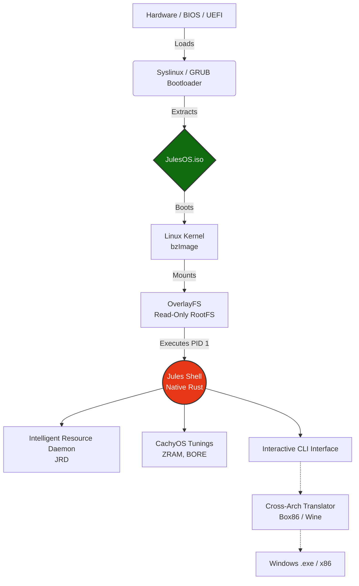

<div align="center">
  <h1>🚀 JulesOS</h1>
  <p><b>High-Performance, Indestructible & Hybrid (BIOS/UEFI) Linux Operating System</b></p>
  
  [](https://github.com/JONIMONI09/JulesOS/actions/workflows/build.yml)
  [](#)
  [](#)
  [](#)
</div>

---

**JulesOS** is a next-generation operating system built on a meticulously stripped-down Alpine Linux core. It is designed for extreme stability, speed (written natively in Rust), and absolute flexibility across architectures.

## 🌟 Core Features

- 🛡️ **Indestructible Core (Immutable Layer):** The OS utilizes a strictly read-only RAM root filesystem (`OverlayFS`). Every reboot resets the system to a pristine state, permanently eliminating viruses, configuration drifts, and system corruption.
- ⚡ **Rust-Based Shell:** The Init process (PID 1) and the core shell (`jules_shell`) are written 100% in pure, native Rust. Memory leaks and C-pointer bugs (e.g., in signal handlers) are fundamentally impossible.
- 🚀 **CachyOS Performance Tuning:** Integrated `ZRAM` compression, AMD-P-State CPU governor forced to maximum performance, and aggressive BORE/EEVDF scheduler optimizations handled directly during the `init` boot process.
- 💻 **Cross-Architecture Translator (Box86/Wine):** A fully Python-written GUI tool (GTK3 Wayland) that allows older x86/32-bit and Windows `.exe` files to run natively on all architectures (e.g., Raspberry Pi 4) in an isolated sandbox via emulation.
- 📱 **Limbo PC Emulator Support (Android):** Fully optimized for mobile! JulesOS generates a Hybrid BIOS/UEFI bootable ISO that natively supports the Limbo PC Emulator out of the box. Boot instantly on your smartphone.
- 🧠 **Intelligent Resource Daemon (JRD):** An autonomous Rust thread within the kernel that actively monitors CPU consumption. If any process hogs >85% CPU, JRD intelligently sends `SIGSTOP` to freeze it, preventing system lag or Kernel Panics, and dynamically resumes it (`SIGCONT`) when resources free up.
- 🛠️ **Native Compiler Stack:** JulesOS is completely self-hosting. It bundles `gcc`, `g++`, `rust`, `cargo`, and `make` deeply into the RootFS.

## 📱 Limbo PC Emulator (Android) Guide
To run JulesOS flawlessly on your smartphone without crashes, use the following settings based on your downloaded ISO:
- **App Version:** Download the **"Limbo x86 Emulator"** APK (Not Limbo ARM, unless you built the `aarch64` ISO).
- **Machine Type:** `q35`
- **CPU Model:** `qemu32` (for x86 ISO) or `qemu64` (for x86_64 ISO)
- **RAM Memory:** **256 MB** or **512 MB** maximum! (If you set this too high, Android's OOM killer will aggressively crash Limbo in the background).
- **Display / Graphics:** `SDL` (Provides the most fluid emulation performance).

---

## 🏗️ System Architecture

JulesOS relies on a highly layered architecture, booting from a custom virtio-optimized kernel into the Immutable RAM Environment.




---

## 🛠️ Local Development & Testing

For developers on Windows hosts, we have engineered an extremely robust local build and test environment that completely bypasses WSL-related volume crashes.

**Requirements:** Windows 11 + Docker Desktop.

1. **Launch Docker Desktop.**
2. **Run the provided PowerShell script:**
   ```powershell
   .\test_local.ps1
   ```
3. **What happens under the hood:**
   - The script builds a dedicated `ubuntu:24.04` container.
   - It performs deep Security Analysis (`Flake8`, `Bandit`, `Trivy`).
   - It compiles the Rust core and creates the hybrid `JulesOS.iso`.
   - It runs an automated headless QEMU boot test (`qemu_boot_test.py`).
   - The final artifacts and analytic crash logs are copied directly to your workspace.

---

## 🛡️ CI/CD & Security (2026 Standards)

JulesOS utilizes a state-of-the-art **Secure-By-Default Pipeline**:
- **Strict Read-Only Scopes**: GitHub Actions run with `permissions: read` to prevent supply chain injection.
- **Smart Caching**: Trivy vulnerability databases and APT/PIP dependencies are aggressively cached.
- **Zero-Zombie Guarantee**: Hard 15-minute Timeouts and strict Concurrency controls prevent billing leaks.

## 📋 Agent Documentation (DOX)

All structural agent rules, failure analyses, and metadata are located in the `.agent/rules/` directory. 
> [!IMPORTANT]
> Whenever new errors occur or system upgrades are developed, **AI Agents MUST consult and update** the `LEARNING.md` within this directory. This is non-negotiable for project stability.
